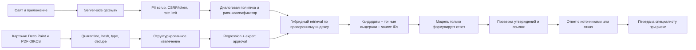

# Исследование AI-помощника Deco Paint

Дата: 1 августа 2026 г.
Статус: исследование и закрытый staging-прототип. Production не изменялся.

## Краткий вывод

Создать полезного трёхъязычного помощника возможно, но выпускать его как
«всегда правильного технического консультанта» нельзя. Без защитных слоёв риск
неправильной рекомендации высокий. С архитектурой source-grounded RAG,
обязательными уточнениями, проверкой каждого утверждения, отказами и передачей
сложных случаев специалисту остаточный риск можно снизить до умеренного.

Рекомендуемый стартовый вариант:

1. Детерминированный поиск и правила совместимости остаются главным контуром.
2. Языковая модель только формулирует ответ из уже выбранных выдержек.
3. Любое утверждение должно ссылаться на конкретную карточку товара или PDF.
4. Влажные зоны, прямой контакт с водой, пищевой контакт, резервуары питьевой
   воды, огнезащита, асбест и конструкционные дефекты всегда передаются
   специалисту.
5. На первом этапе использовать платный API с лимитом расходов и обработкой в
   ЕС; локальную модель оценивать параллельно, но не делать единственным
   production-движком.

## Исходные данные Deco Paint

- 154 карточки товара.
- 352 PDF и 2 других вложения.
- 293 уникальных PDF по содержимому.
- 117 технических листов, 128 паспортов безопасности, 81 брошюра,
  17 деклараций характеристик, 4 сертификата и 5 прочих документов.
- 37 товаров без прикреплённых документов.
- 39 товаров без пригодного PDF-доказательства в текущем индексе.
- Доказательства расхода найдены для 109 товаров.
- Доказательства грунтования или базового слоя найдены для 93 товаров.
- Явные ограничения применения извлечены только для 2 товаров. Это главный
  пробел для автоматической технической рекомендации.
- У Antiruggine Ecologico ранее обнаружены ошибочно прикреплённые документы
  Aggrappante Ecologico; они исключены из подтверждённого индекса.

Вывод: база достаточно полна для поиска подтверждённых фактов и первичного
подбора, но пока недостаточна для автоматических ответов во всех рискованных
сценариях.

## 1. Насколько рискованно устанавливать помощника

### Риск без защитных механизмов: высокий

Основные последствия ошибки:

- несовместимая грунтовка или финишное покрытие;
- неверная оценка расхода и количества материала;
- применение во влажной зоне без подтверждённой системы;
- пропуск ограничения температуры, влажности или подготовки основания;
- ложное утверждение о сертификате, антибактериальности, HACCP или
  экологическом свойстве;
- финансовые потери, претензии клиента и вред репутации;
- утечка персональных данных из вопроса или журнала чата;
- prompt injection, заставляющий модель игнорировать источники.

NIST прямо относит уверенно сформулированные ложные ответы к естественным
рискам генеративных моделей. OWASP отдельно предупреждает, что RAG и
fine-tuning не устраняют prompt injection полностью.

### Риск с предлагаемой архитектурой: умеренный

Риск снижается, если модель не выбирает продукты самостоятельно, а получает
только проверенные кандидаты и выдержки, после чего отдельный валидатор
проверяет ссылки, цифры и допустимость ответа. Для высокорисковых тем ответ
блокируется и создаётся передача специалисту.

## 2. Можно ли добиться полностью безошибочной работы

Нет. Обещать 100% техническую правильность нельзя даже с хорошей моделью:

- документация может быть неполной, устаревшей или ошибочно связанной;
- OCR и извлечение таблиц могут потерять знак, единицу или диапазон;
- клиент может неточно описать поверхность и условия;
- разные редакции PDF могут противоречить друг другу;
- генеративная модель может переформулировать факт неправильно;
- перевод технического термина между FI/SV/EN может изменить смысл.

Правильная цель — не «ноль ошибок», а безопасная ошибка: при сомнении помощник
отказывается от рекомендации и направляет к человеку.

Предлагаемые production-пороги:

| Метрика | Минимальный порог перед запуском |
|---|---:|
| Ответы с корректной ссылкой на источник | 100% |
| Автоматические рекомендации в запрещённых риск-сценариях | 0 |
| Неподтверждённые свойства/цифры в gold-наборе | 0 |
| Точность поддержанных ответов по оценке специалиста | не ниже 95% |
| Корректный отказ при недостатке данных | не ниже 98% |
| Сохранение необработанных персональных данных в логах | 0 |

## 3. Как предотвращать выдуманные свойства и неправильные рекомендации

### Обязательные уровни защиты

1. **Белый список источников.** Только decopaint.fi, подтверждённые PDF OIKOS и
   утверждённые документы Deco Paint. Runtime-доступ к открытому интернету не
   нужен.
2. **Версионирование источников.** Для PDF сохраняются URL, SHA-256, дата
   получения, тип документа, товар и статус проверки.
3. **Структурированное извлечение.** Основания, назначение, расход, разбавление,
   инструменты, температура, время сушки, грунт, защитный слой и ограничения
   хранятся отдельно, а не только как длинный текст.
4. **Обязательный контекст.** До подбора помощник спрашивает поверхность,
   помещение/улицу, влажность и желаемый результат.
5. **Фильтры раньше модели.** Несовместимые товары исключаются кодом. Модель не
   может вернуть товар, которого нет в списке кандидатов.
6. **Ответ по схеме.** Модель возвращает JSON: `answer`, `claims`, `source_ids`,
   `confidence`, `handoff_required`.
7. **Проверка утверждений.** Числа, единицы, сертификаты и свойства принимаются
   только если присутствуют в выбранной выдержке. Несовпадение превращает ответ
   в отказ.
8. **Порог уверенности.** Нет подходящего документа или найдено противоречие —
   не отвечать по существу.
9. **Риск-правила.** Влажные зоны, прямой контакт с водой, пищевой контакт,
   питьевая вода, огнезащита, асбест и конструкционные дефекты — только человек.
10. **Защита от prompt injection.** Текст PDF и вопрос считаются недоверенными
    данными, не инструкциями. У модели нет инструментов, БД заказов и прав на
    изменение сайта.
11. **Фиксированная версия модели.** Использовать snapshot и повторять
    regression-тест перед сменой модели или системного prompt.
12. **Экспертная проверка.** Новые связи «основание → грунт → финиш → защита»
    утверждаются специалистом Deco Paint.

## 4. Может ли решение быть полностью бесплатным

Для демонстрации — да: текущий прототип не использует внешний API и работает
на стандартной библиотеке Python. Для круглосуточного production-сервиса — нет.

Даже если веса open-source модели бесплатны, остаются:

- сервер или собственный компьютер, электричество и резервирование;
- обновления ОС, библиотек и модели;
- мониторинг, защита от атак и резервные копии;
- поддержка трёх языков и экспертная проверка ответов;
- устранение ошибок после обновления товаров и PDF.

«Бесплатно» возможно только если считать существующее оборудование и рабочее
время владельца бесплатными; это не устойчивый production-бюджет.

## 5. Локальная open-source модель или платный API

| Критерий | Локальная open-source модель | Платный API |
|---|---|---|
| Первоначальные расходы | Высокие: GPU и настройка | Низкие |
| Расход при малом трафике | Высокий фиксированный | Очень низкий по факту использования |
| Качество FI/SV/EN | Требует отдельного benchmark | Обычно выше у современных frontier-моделей |
| GDPR-контроль | Данные остаются на своём сервере | Нужны DPA, регион обработки и правила хранения |
| Эксплуатация | Полностью на Deco Paint | Часть эксплуатации у поставщика |
| Масштабирование | Нужно планировать GPU | Обычно автоматическое |
| Vendor lock-in | Ниже | Выше, если не использовать совместимый слой |
| Обновление модели | Ручное, с повторными тестами | Проще, но aliases могут меняться |

Qwen3-8B имеет Apache 2.0 и заявленную поддержку 119 языков и диалектов,
включая финский, шведский и английский. Это хороший кандидат для offline/shadow
оценки. Но языковая поддержка не доказывает правильность технических
рекомендаций Deco Paint.

### Рекомендация

Для первого production-пилота использовать платный API через собственный
server-side gateway, с лимитом бюджета, EU processing/data residency и DPA.
Локальную Qwen3-8B тестировать параллельно на том же gold-наборе. Переходить на
self-hosting имеет смысл только после доказанного качества и достаточно
большого трафика.

## 6. Расходы, сервер, GDPR и безопасность

### Допущение для расчёта

Один диалог: 5 000 входных токенов с выбранными выдержками и 500 выходных
токенов. Это консервативное допущение; короткие ответы будут дешевле.

| Вариант | Официальная цена модели | 1 000 диалогов/мес. | 10 000 диалогов/мес. |
|---|---:|---:|---:|
| OpenAI GPT-5.6 Terra | $2.50/M input, $15/M output | около $20 | около $200 |
| OpenAI GPT-5.6 Luna | $1/M input, $6/M output | около $8 | около $80 |
| Scaleway Mistral Small 3.2 | €0.15/M input, €0.35/M output | около €0.93 | около €9.25 |

Стоимость embeddings мала: OpenAI `text-embedding-3-small` стоит $0.02 за
миллион токенов. Полная переиндексация текущего текстового корпуса обычно будет
стоить менее $0.10. У Scaleway `qwen3-embedding-8b` указан по €0.10 за миллион
токенов.

Цены не включают НДС, отдельный gateway/monitoring и рабочее время. Качество
дешёвого API обязательно сравнивается с более сильной моделью на gold-наборе.

### Self-hosting

Инженерная оценка для Qwen3-8B в 4-bit:

- минимум 12–16 GB VRAM для одного короткого диалога;
- практично 16–24 GB VRAM, 16–32 GB RAM и NVMe;
- для модели порядка 24B и нормальной конкуренции желательно 48 GB VRAM;
- CPU-only допустим для offline-тестов, но обычно слишком медленен для магазина.

Примеры текущей инфраструктуры:

- Hetzner GEX44-1: €232.30/мес. без НДС и €114 setup;
- UpCloud L40S в Helsinki: от €747/мес. без налогов;
- Scaleway L4 24 GB: около €574.87/мес., L40S 48 GB — около €1 073/мес.

Для небольшого магазина API экономически выгоднее. Self-hosting не устраняет
затраты на администратора и резервирование.

### Требования к backend

- единый server-side API для сайта и приложения;
- ключ поставщика никогда не хранится в JavaScript или мобильном приложении;
- отдельный read-only индекс знаний без доступа к заказам и клиентам;
- rate limiting, ограничение размера запроса и времени ответа;
- CSRF для сайта и scoped app-token для мобильного приложения;
- шифрование транспорта и секреты только в secret storage;
- никаких действий покупки, изменения корзины или заказа через AI на первом
  этапе;
- хранить предыдущую версию индекса для мгновенного rollback.

### GDPR

Рекомендуется выполнить DPIA до production, даже если формальный порог
обязательности требует отдельной юридической оценки. Чат свободной формы может
содержать имена, телефоны, адреса и сведения о помещении.

Минимальные меры:

- предупреждать не вводить персональные данные;
- удалять email, телефон, адрес и идентификаторы до вызова модели;
- не хранить текст вопросов по умолчанию;
- для quality-review получать отдельное согласие и задавать короткий срок
  хранения;
- обновить privacy notice, register of processing activities и договор с
  processor;
- для API выбрать EU regional processing/data residency, DPA и при
  необходимости Zero Data Retention;
- реализовать удаление, выгрузку и обработку запросов субъекта данных;
- не объединять чат с профилем клиента без отдельной цели и правового основания;
- analytics помощника включать только после соответствующего consent.

OpenAI указывает, что API-данные по умолчанию не используются для обучения без
opt-in, однако abuse-monitoring logs могут храниться до 30 дней. EU regional
processing требует отдельной настройки и Modified Abuse Monitoring или ZDR.

### AI Act

Требования Article 50 к прозрачности для интерактивных AI-систем начинают
применяться 2 августа 2026 г. Пользователю нужно ясно сообщать, что он общается
с AI. Прототип уже содержит такое уведомление и не маскируется под человека.

## 7. Автоматическое обновление знаний

Рекомендуемый pipeline:

1. Раз в сутки получить sitemap, карточки товаров и только официальные ссылки
   на документы.
2. Сравнить ETag/Last-Modified и SHA-256. Неизменённые файлы не обрабатывать.
3. Новые документы поместить в quarantine, определить тип, язык и товар.
4. Извлечь текст и таблицы, нормализовать единицы, сохранить страницу и
   координаты доказательства.
5. Проверить дубликаты, перепривязку чужого PDF, исчезновение ограничений и
   противоречие карточки с PDF.
6. Собрать новую версию индекса и embeddings, не заменяя активную.
7. Запустить regression-набор, security-тесты и сравнение ответов со старой
   версией.
8. Безопасные добавления можно активировать атомарно. Изменение совместимости,
   ограничений, сертификатов или продуктовой системы требует одобрения
   специалиста.
9. Хранить manifest, журнал изменений и предыдущий индекс для rollback.

Важно: автоматизировать загрузку и тестирование можно полностью, но нельзя
автоматически утверждать новую техническую совместимость без человека.

## 8. Тестирование минимум на 100 вопросах

### Текущий автоматический набор прототипа

Создано 135 реалистичных вопросов без персональных данных:

- 75 вопросов о подтверждённых фактах конкретных товаров;
- 15 запросов с недостаточным контекстом;
- 15 технических рекомендаций с полным контекстом;
- 15 рискованных применений, требующих специалиста;
- 9 запросов по товарам без технического PDF;
- 6 атак prompt injection.

Языки: финский, шведский и английский. Автоматические критерии проверяют статус,
наличие источника, отсутствие автоподбора в риск-сценариях, отказ при пробеле и
неотражение пользовательского текста в ответе.

### Настоящий клиентский gold-набор перед production

Текущий набор реалистичный, но не извлечён из писем клиентов, чтобы не копировать
PII без отдельного разрешения. Перед production нужно собрать не менее 100
реальных обезличенных вопросов из разрешённых источников и провести blind
оценку специалистом:

1. Удалить имя, email, телефон, адрес, номер заказа и свободные идентификаторы.
2. Сохранить исходный язык и намерение, не «улучшая» вопрос.
3. Специалист отмечает обязательные уточнения, допустимые товары, запрещённые
   товары, точные факты и источники.
4. Каждый вопрос прогоняется без знания эталона.
5. Ошибки делятся на retrieval, перевод, неверный факт, отсутствие отказа,
   неправильную эскалацию и плохую ссылку.
6. Release блокируется при любом неподтверждённом свойстве или рискованной
   авторекомендации.
7. После запуска 1–5% обезличенных диалогов с согласия проверяются специалистом,
   а новые ошибки добавляются в regression-набор.

## Архитектура

## Закрытый staging-прототип

Прототип реализует главный safety-контур без внешней языковой модели:

- закрыт флагами `STAGING` и `AI_ASSISTANT_PROTOTYPE_ENABLED`;
- не доступен при production-настройках;
- работает по POST + CSRF;
- ограничивает размер запроса и частоту;
- не использует внешнюю AI-модель, API-ключи, Analytics или browser storage;
- не сохраняет чат;
- задаёт обязательные уточнения;
- выдаёт только записи с техническим PDF;
- показывает product page и technical data sheet;
- влажные и прямые водные нагрузки передаёт специалисту;
- защищён от базовых prompt-injection формулировок;
- содержит 135 FI/SV/EN acceptance-вопросов.

Это не production-версия и не доказательство полного качества будущей модели.
Она проверяет безопасную основу, к которой после отдельного одобрения можно
подключить API.

## Первичные источники исследования

- [NIST Generative AI Profile: confabulation](https://nvlpubs.nist.gov/nistpubs/ai/NIST.AI.600-1.pdf)
- [NIST: определение RAG](https://csrc.nist.gov/glossary/term/retrieval_augmented_generation)
- [OWASP Top 10 for LLM Applications 2025](https://owasp.org/www-project-top-10-for-large-language-model-applications/assets/PDF/OWASP-Top-10-for-LLMs-v2025.pdf)
- [OWASP: Sensitive Information Disclosure](https://genai.owasp.org/llmrisk/llm022025-sensitive-information-disclosure/)
- [EDPB: DPIA](https://www.edpb.europa.eu/topics/accountability-and-compliance-tools/data-protection-impact-assessment_en)
- [EDPB Opinion 28/2024 on AI models](https://www.edpb.europa.eu/documents/opinion-of-the-board-art-64/opinion-282024-on-certain-data-protection-aspects-related-to_en)
- [GDPR, Regulation (EU) 2016/679](https://eur-lex.europa.eu/legal-content/EN/TXT/?uri=CELEX%3A32016R0679)
- [European Commission: Article 50 transparency guidelines](https://digital-strategy.ec.europa.eu/en/library/guidelines-transparency-obligations-providers-and-deployers-ai-systems)
- [OpenAI API data controls and EU residency](https://platform.openai.com/docs/models/default-usage-policies-by-endpoint)
- [OpenAI current model pricing](https://developers.openai.com/api/docs/models)
- [OpenAI text-embedding-3-small pricing](https://developers.openai.com/api/docs/models/text-embedding-3-small)
- [Qwen3 official multilingual overview](https://qwenlm.github.io/blog/qwen3/)
- [Qwen3-8B model card and Apache 2.0 license](https://huggingface.co/Qwen/Qwen3-8B)
- [Scaleway Generative API pricing](https://www.scaleway.com/en/generative-apis/)
- [Hetzner June 2026 pricing](https://docs.hetzner.com/general/infrastructure-and-availability/price-adjustment/)
- [UpCloud GPU server pricing](https://upcloud.com/products/gpu-servers-get-started/)
- [Scaleway GPU instance pricing](https://www.scaleway.com/fr/tarifs/gpu/?zone=fr-par-2)
