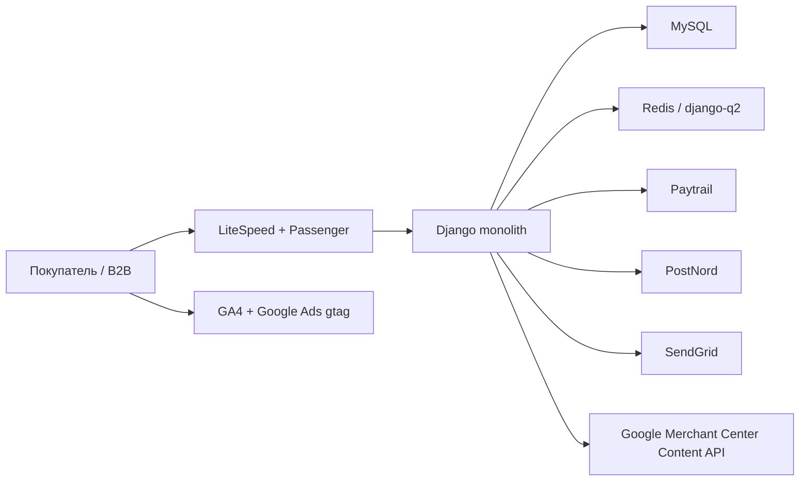

# Архитектура decopaint.fi

## Контекст

## Компоненты

| Контур | Реализация | Замечание |
|---|---|---|
| Каталог | `shop` | Products, variants, category tree, images, documents, prices, coupons |
| Корзина | `cart` | session cart и shipping selection |
| Заказы | `order` | Order/OrderItem, totals, delivery, status |
| Платежи | `pk_paytrail` | создание платежа, success/cancel callbacks |
| Доставка | `pk_postnord` | методы PostNord |
| Пользователи | `users` | custom user, профиль, история заказов |
| Merchant | `google_shopping` | Content API, sync и delete endpoints |
| B2B | `b2b` | заявки компаний; требования требуют уточнения |
| Контент | `blog`, `courses`, `services` | SEO/CMS-секции |
| Почта | `mail`, SendGrid | сообщения и подтверждения |
| Фоновые задачи | django-q2 | запуск и мониторинг кластера не подтверждены |

## Инфраструктура

- cPanel/LiteSpeed shared hosting, home `/home/decpai`.
- Основной document root: `/public_html`; Django: `/public_html/deco`.
- MySQL DB: одна production база около 282 MB.
- Passenger WSGI.
- Ежедневные JetBackup на внешнем Contabo storage.
- Отдельного Git deployment, CI/CD и полноценного staging нет.

## Критические границы

1. Browser → Django: session/CSRF/auth/rate limiting.
2. Django → Paytrail: secret, HMAC, amount/currency, idempotency.
3. Paytrail → callback: signature, status transition, replay protection.
4. Django → Merchant: OAuth credential и разрушительные операции.
5. Django → SendGrid: PII и deliverability.
6. Production → backup/staging: секреты и персональные данные.

## Целевая схема

- Git repository с `main`, `staging`, feature branches.
- Отдельные environment settings; все секреты вне source tree.
- Закрытый staging с отдельной БД и synthetic/anonymized fixtures.
- CI: dependency audit, lint, tests, Django deploy check, template checks.
- CD: backup → migrate → collectstatic → smoke tests → rollback gate.
- Error monitoring и health endpoints без PII.
- Поддерживаемая версия Django/Python.
