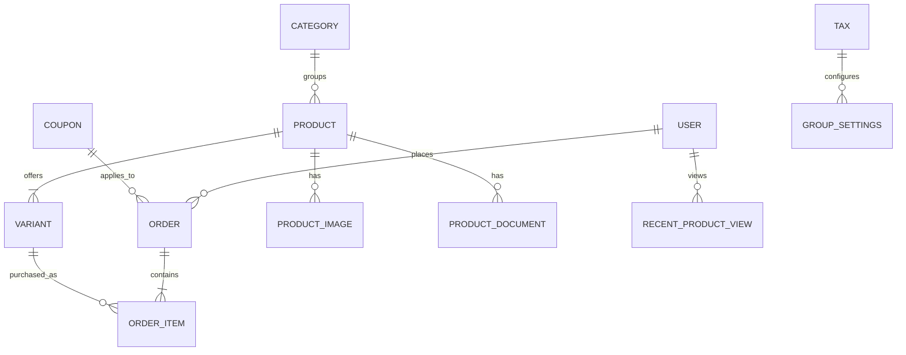

# Data model

## Основные сущности

## Критичные инварианты

- Order total фиксируется при создании и не пересчитывается из текущих цен для исторического заказа.
- Оплаченный Order имеет уникальный Paytrail transaction ID.
- Paid transition однонаправлен без явного refund workflow.
- OrderItem хранит snapshot SKU/name/price/tax, а не зависит только от mutable Variant.
- Merchant item ID устойчив и однозначно сопоставляется с Variant/Product.
- Stock/order-product status имеет единый словарь для сайта, Merchant и Ads.
- B2B price/permission никогда не определяется только frontend.

## Пробелы

- Текущая модель имеет только boolean `payed` и общий status; нужна явная payment state machine.
- Не обнаружена outbox/event model для email/analytics/integrations.
- Retention и anonymization flags не определены.
- Требуется ERD по фактическим migrations и constraints до любых миграций.
